# Women Mentor

Women Mentor is a platform that aims to help achieve gender equality by empowering more women to get into the tech industry. It is aimed at **Goal 5 (Gender Equality and Women’s Empowerment)** of the UN Sustainable Development Goals.

Through this concept, we hope to remove the unconscious bias of male dominance in the tech industry by: 

- Making women in tech more visible to fellow females *(5.1 End discrimination against all women and girls).*
-  Using technology to connect inspiring women to other aspiring women *(5.2 Promote empowerment of women through technology)*
-  Building a safe and strong support network where women are encouraged to fulfill their potential, thus leading to an increase in female representation in the industry *(5.5 Ensure full participation in leadership and decision making)*
<br/>
<br/>

## Getting Started

### 1. Installing Flutter
Follow the install instructions here: https://flutter.dev/docs/get-started/install.  
This project uses Flutter 2.0 with support for null safety.
<br/>

### 2. Configuring the project on Firebase
This project uses the following package names for both Android and iOS apps:
`com.jeremy.aequalis`

You will need to register the project on your Firebase account. 
Once this is done, you can download the `ios/Runner/GoogleService-Info.plist` and `android/app/google-services.json` files from your Firebase project settings.  
Finally, enable the Email/Password Authentication sign-in provider in the Firebase Console.

Detailed instructions for how to complete the setup can be found in the links below.  

**Android**  
https://firebase.flutter.dev/docs/installation/android  

**iOS**  
https://firebase.flutter.dev/docs/installation/ios

To correctly configure social authentication please check:  
https://firebase.flutter.dev/docs/auth/social

## Running the app
From the client directory, run the following commands in a terminal

```dart
flutter pub get
flutter run
```
## App screenshots

<div style="text-align: center">
  <table>
    <tr>
      <td style="text-align: center">
        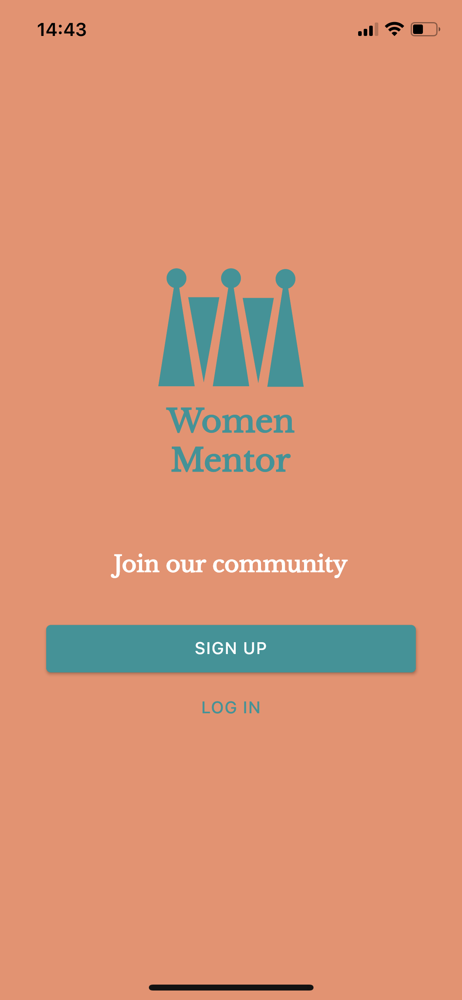
      </td>
      <td style="text-align: center">
        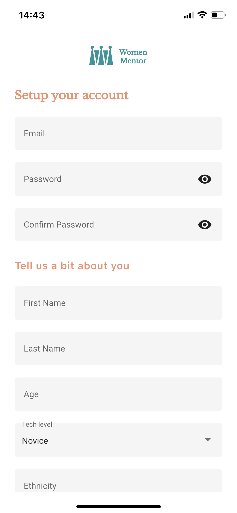
      </td>
      <td style="text-align: center">
        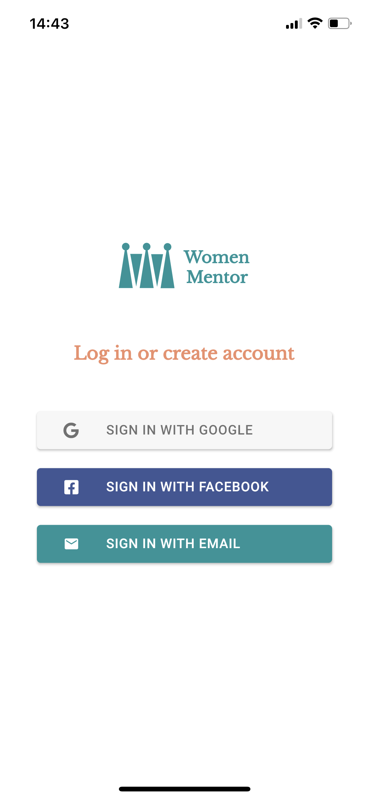
      </td>
      <td style="text-align: center">
        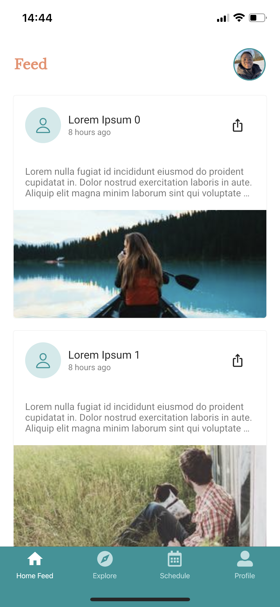
      </td>
      <td style="text-align: center">
        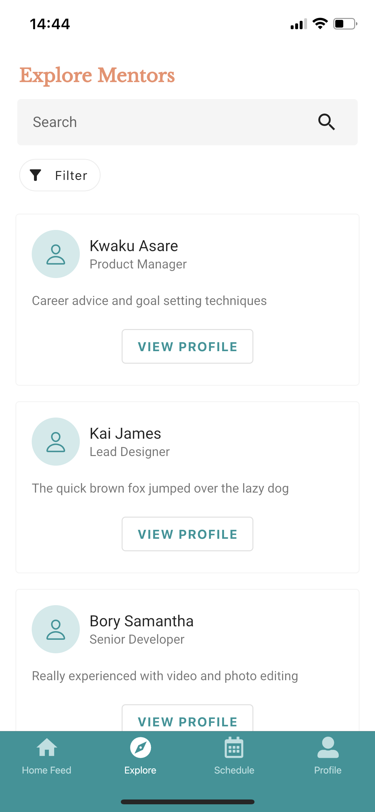
      </td>
    </tr>
    <tr>
      <td style="text-align: center">
        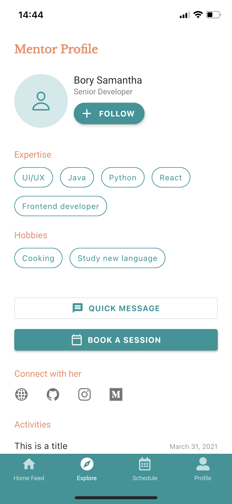
      </td>
      <td style="text-align: center">
        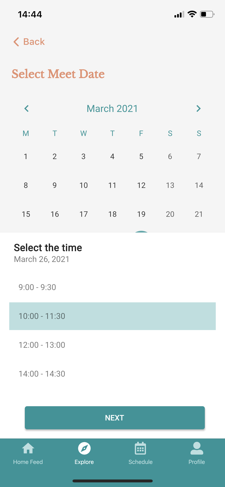
      </td>
      <td style="text-align: center">
        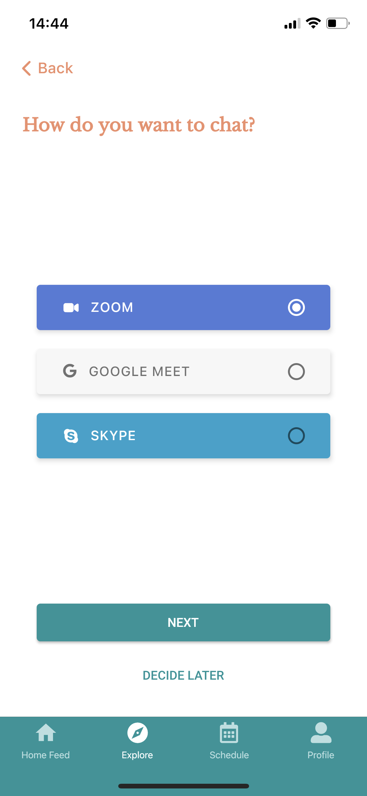
      </td>
      <td style="text-align: center">
        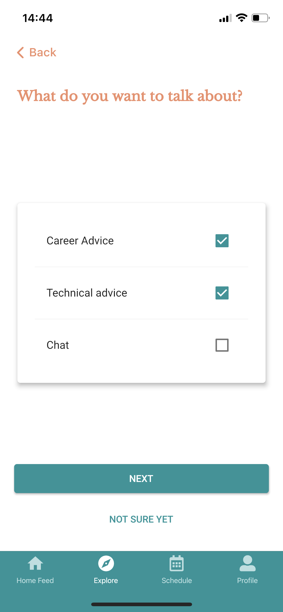
      </td>
      <td style="text-align: center">
        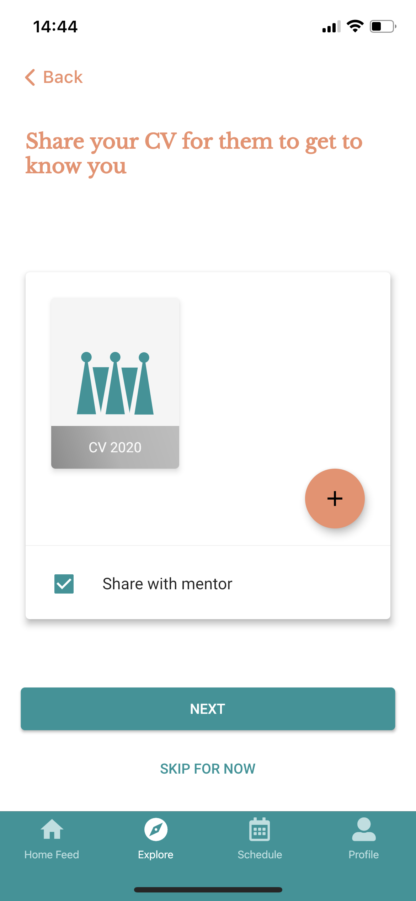
      </td>
    </tr>
    <tr>
      <td style="text-align: center">
        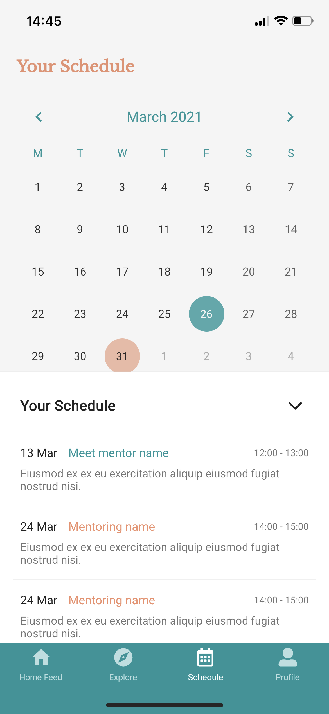
      </td>
      <td style="text-align: center">
        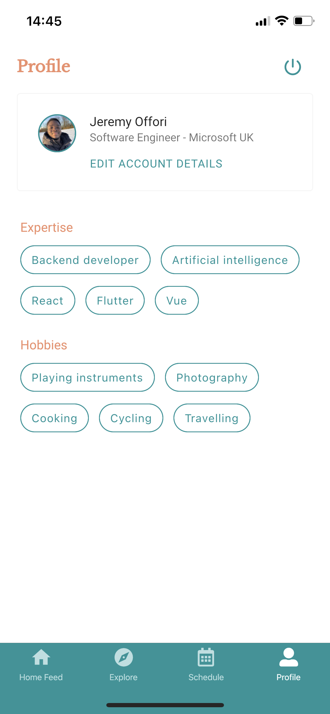
      </td>  
    </tr>
  </table>
</div>

<br/>

## Main Tools used

- Firebase Authentication
- Firestore Database
- Firebase Cloud Functions
- Firebase Cloud Messaging
- Google Sign In
- Facebook Login
- Riverpod

For a full listing of external packages used please check the `pubspec.yaml` file.

Reference guide used for defining the app architecture:
- [Starter Architecture Demo for Flutter & Firebase Realtime Apps](https://github.com/bizz84/starter_architecture_flutter_firebase)